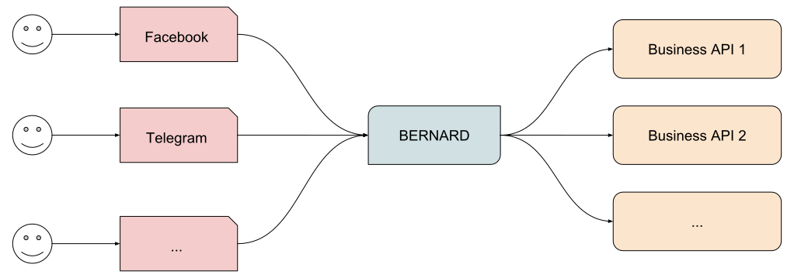

Concepts
========

BERNARD uses a few basic concepts that are mostly instinctive but were
defined a bit further with the idea of fitting with all the platforms
at the same time.

## Architecture

Bots are a way to easily access a specific service. In that sense, they
do translate a human interaction into an API call, gets the result and
they translates it back into human language. It looks like this:

As you can see, BERNARD is at the center of the information flow, but
the buisness-related intelligence is located in external APIs.

This means that although BERNARD is a Python framework, it can integrate
with services written in any other language and seamlessly communicate
with your existing infrastructure.

## NLU

NLU stands for "Natural Language Understanding". It's considered to be
the single most important feature of bots and "Artificial Intelligence"
is a very hot topic at the moment. However, let's dial down a bit:

- "Artificial Intelligence" is very dumb. Very very dumb. Google is the
  top player in that field so don't expect to perform better than they
  do. And you can't really have a conversation with a Google Assistant,
  can you?
- In practice, we observe that about 3% of people use NLU to interact
  with bots. When there was a 3% market share for IE6, a lot of people
  already had stopped supporting it.

In short, don't try to pass the
[Turing test](https://en.wikipedia.org/wiki/Turing_test). Instead,
create an experience that don't depend on understanding what your users
say.

However, there is still a need to understand a few things. And also,
if you're selling bots, your clients will ask for it and even if they
don't they will expect it and if you don't plan ahead this is going to
suck up all your energy. Which is not worth it for about 3% of users.

There is a built-in [intents detection system](./nlu.md) based on very
simple techniques. There is also the
[Iron Throne](https://github.com/BernardFW/iron-throne) project that
proposes a very simple NLU engine which can be quite effective for
some uses. If none of those fit your needs, you can turn to external
services like `wit.ai`, `dialogflow.com` or `luis.ai`. And finally, if
you want something very specific and a lot of control over it, you can
try [rasa NLU](https://nlu.rasa.com/).

## Atoms

After analyzing all existing messaging platforms, there is 3 specific
atoms that stood out and that are the base of BERNARD's API.

### Users

Platforms will give you very little information about your users. You
will get the following:

- **ID**
- **Name** (at least some form of it)
- **Language** (most of the time)
- **Time zone** (sometimes)

As you can see, the only thing we can reliably count on is an ID. Please
note that in some platforms like Messenger, IDs are bot-scoped.

### Conversations

Bots are not necessarily in a 1-1 conversation with users. Users might
insert a bot within an existing conversation.

The interesting thing is that most platforms don't give you any
information about conversations. In the end it boils down to:

- **ID**
- **List of people** (rarely)

### Messages

Messages are the most difficult atom to model. Most of the time, they
will include "rich" content like images, videos, carousels of items,
action buttons and so on.

They can be broken down to this:

- **Sender**
- **Recipient**
- **Content**

The content is based on layers. By example an image with a caption
would be an `Image` layer plus a `Text` layer. A text with quick replies
(which is a Facebook-specific concept) would be a `Text` plus a
`QuickRepliesList` layer.

Example:

In this real-world example we can see that a text message is associated
to quick replies. Internally, this is represented by BERNARD layers and
then automatically translated into Facebook API calls.

**WARNING**: don't confuse different layers with different messages. If
you want to send two images, don't send a single message with two
`Image` layers, but rather two messages with a single `Image` layer in
each.

## Wrap-up

BERNARD bots are a way to translate human queries into API queries and
display back the result. They use 3 atoms which are users, conversations
and messages. Finally, messages are built using layers of content, which
allow to use a simple API which covers all platforms.

**Next step**: [Finite-state Machines](./fsm.md)
