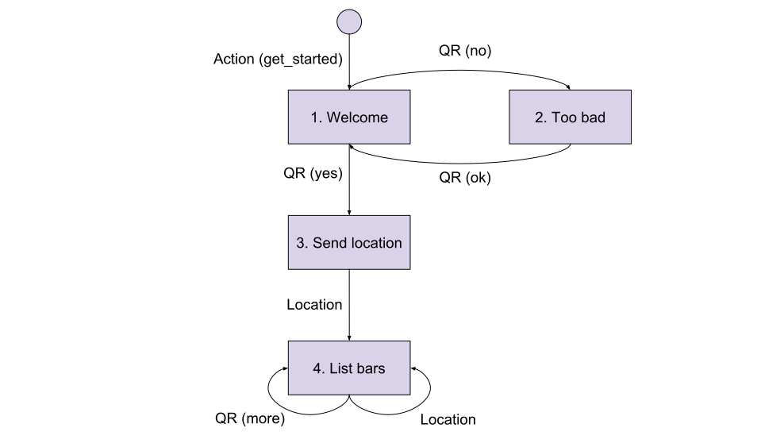

Finite-state Machines
=====================

Finite-state Machines (herafter shortened to "FSM") are an abstract
machine that is widely used because it's a simple way to describe a
process. [Wikipedia](https://en.wikipedia.org/wiki/Finite-state_machine)
will tell you all about the maths and definitions but here's we'll focus
on what matters for BERNARD.

Basically, a FSM is a set of **states** which are connected to each
other by **transitions**. At any moment, the machine is at exactly
one state. When an event occurs, it will *trigger* a transition and
move to another state.

## Sample conversation

Let's consider the following conversation:

- **User**: *clicks "Get Started"*
- **Bot**: Welcome John, I will help you find bars! But before, do you
  accept my terms of service?
- **User**: No *(quick reply)*
- **Bot**: Fine. You can accept later by saying "OK".
- **User**: OK *(quick reply)*
- **Bot**: Great! Please send me your location
- **User**: *Location*
- **Bot**: Awesome, here's bars near your location: \[...\].

## FSM model

This can be modeled as follows:

- The squares are states. When the bot enters a state (and only then) it
  can send messages to the user.
- The arrows are triggers. It's the possible actions that the user can
  do to trigger a transition from one state to the other.
- The small disc on top is the initial state.

Triggers can only be activated if the current state is its starting
point. By exemple, if the user sends his location right at `1.` nothing
will happen while it would trigger a transition if it was in `3.` or
`4.`.

Triggers starting from the initial state are always candidates, even if
the user is currently engaged in a conversation. This allows the user to
jump from one feature to another without having to exhaust the flow.

In the current case, if the user clicked "Get Started" again while
seeing bars, the conversation would start again.

## Probabilistic model

One thing with user interactions is that you can't always be 100% sure
of what they mean, espcially if you do NLU. In BERNARD, each trigger
will emit a *probability* that a given user action matches what the
trigger expects. Then BERNARD will select the most likely trigger and
go with it.

## Wrap-up

FSMs are a simple way to describe a conversation. They have states which
are connected by triggers. Triggers will be activated by user actions
based on a probabilistic model. This is what drives transitions between
states. And finally, the initial state is a meta-state which is always
considered onto which you can attach the starting points of your
scenarii.

**Next step**: [installation](./installation.md)
