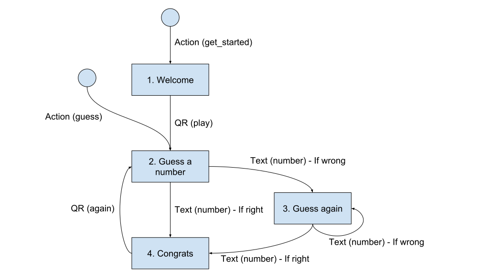

Number Bot
==========

As an exercise, we're going to create a simple bot that will ask you
to guess a number between 1 and 100. When you guess it, you can play
again!

It's a good exercise to get to know the main features of BERNARD.

Please note that this bot uses Facebook-specific features and is not
compatible out-of-the-box with other platforms.

## Conception

A typical conversation would be:

- **Bot**: Welcome! Do you want to play?
- **User**: Let's play *(quick reply)*
- **Bot**: Guess a number between 1 and 100
- **User**: 50
- **Bot**: Nope, lower
- **User**: 42
- **Bot**: Great! Do you want to play again?

This gives the following flow:



## Starting the project

Let's start the project!

### Create the code

First, create the code skeleton. You need to have followed the
[installation](./installation.md) instructions.

```bash
bernard start_project number_bot ~/dev/number_bot
```

Of course you can adjust `~/dev/number_bot` to the location where you
want to put your project.

### Get a HTTPS URL

You will need a **public HTTPS URL** for your bot to work. If you don't
have one, you can try using [`ngrok`](https://ngrok.com/) for this
purpose.

```bash
ngrok http 8666
```

If you have another way to have this, please do so. In any case, you
need to note down this URL. From here on, we'll refer this as
`https://YOUR.DOMAIN.COM`.

### Configure Facebook

Then, you need to get Facebook tokens and IDs. In order to do so, you
need to:

1. [Create a Facebook page](https://www.facebook.com/pages/create/)
2. Copy the page ID (that's the big ID in the URL)
3. [Create a Facebook app](https://developers.facebook.com/)
4. Copy the app ID and app secret (they are available in the app's
   basic settings)
5. Go to the "Messenger/Settings" part of your app's admin and generate
   the token for the page you created.

### Create your `env` file

By default, the configuration is read from environment variables. Let's
create a `env` file with the following content:

```bash
set -a

DEBUG=yes

BERNARD_SETTINGS_FILE=/PATH/TO/YOUR/SETTINGS/FILE.py
BERNARD_BASE_URL=https://YOUR.DOMAIN.COM
WEBVIEW_SECRET_KEY=A_SECRET_KEY

FB_APP_ID=XXXX
FB_APP_SECRET=XXXX
FB_PAGE_ID=XXXX
FB_PAGE_TOKEN=XXXX
FB_SECURITY_TOKEN=SOME_ARBITRARY_VALUE
```

Don't forget to replace the values with the approriate values in your
case (the public HTTPS URL, the Facebook IDs, etc). By default, the
`create_project` command has created the `env` file with consistent
values, so you can just focus on the `FB_*` values.

Please note that you can put any arbitrary value in `FB_SECURITY_TOKEN`,
it just need to be a unique and secure string.

Once the file is complete, you can source it then start the bot.

```bash
source ./env
./manage.py run
```

And then connect your bot to Facebook. You need to go back to your app's
settings in Facebook developers, in the "Messenger/Settings" section,
and then subscribe to the webhook.

You need to put the following values:

- **Callback URL**: `https://YOUR.DOMAIN.COM/hooks/facebook`
- **Verify Token**: The value that you put in `FB_SECURITY_TOKEN`
- **Subscribed events**: `messages`, `messaging_postbacks`,
  `messaging_optins`

Once the webhook is validated, still in the "Webhook" section of the
Messenger settings, you can subscribe the app to the page you created.

At this point, you should be able to talk to your bot by going to
`http://m.me/FB_PAGE_ID` (please replace `FB_PAGE_ID` by the actual ID).

## Creating the states

We'll use the `states.py` file to create all four states that we
designed earlier.

First, make sure to have the following imports:

```python
from random import (
    SystemRandom,
)

from bernard import (
    layers as lyr,
)
from bernard.analytics import (
    page_view,
)
from bernard.engine import (
    BaseState,
)
from bernard.i18n import (
    intents as its,
    translate as t,
)
from bernard.platforms.facebook import (
    layers as fbl,
)

from .store import (
    cs,
)

random = SystemRandom()
```

### 1. Welcome

The welcome state is fairly simple, since it just unconditionnally sends
a message.

```python
class S001xWelcome(NumberBotState):
    """
    Welcome the user
    """

    @page_view('/bot/welcome')
    async def handle(self) -> None:
        name = await self.request.user.get_friendly_name()

        self.send(
            lyr.Text(t('WELCOME', name=name)),
            fbl.QuickRepliesList([
                fbl.QuickRepliesList.TextOption(
                    slug='play',
                    text=t.LETS_PLAY,
                    intent=its.LETS_PLAY,
                ),
            ]),
        )
```

Let's break this down.

First of all, the class `S001xWelcome` is named in order to have its
reference number. That's just a convention which has no technical
impact, but is quite helpful as the project grows. Let's also note that
it inherits from `NumberBotState`. That's a way to inherit the `error()`
and `confused()` functions. You can override them on a per-state basis
if you want to customize error messages.

Each state implements a `async def handle(self) -> None` function. All
the action happens there. When the FSM enters a state, this `handle()`
function is called. During the handling, you can call `self.send()` as
many times as you want to. The messages are not sent immediately, but
rather stacked up and sent after the handling function returns.

There is a `@page_view()` decorator. This is used for analytics tracking
in case where the analytics tracked is configured (which is not the
case here).

A single call to `self.send()` generates exactly one message (unless
some special cases or mingling by a middleware). All the arguments given
to `self.send()` are layers. The order of layers matters!

#### Layers

We have two layers in this message:

- `lyr.Text(t.WELCOME)` is a text layer, whose text is the `WELCOME`
  string that you can find in `responses.csv`
- `fbl.QuickRepliesList()` is a list of quick replies that will be
  suggested to the user after the message itself

#### Translations

The translation system works the following way. First, there is the
imports:

```python
from bernard.i18n import (
    intents as its,
    translate as t,
)
```

There is two things here: the intents (`its`) and the translations
(`t`). They come respectively from `intents.csv` and `responses.csv`.

Here are the two ways to use the translations:

- `t.LETS_PLAY` will return a simple translation
- `t('WELCOME', name=name)` will return a parametrized translation

Please note that returned values are not strings (nor "lazy" strings)
but rather translation objects that will be rendered when sending the
messages.

If a translation appears several times in the `responses.csv` file, the
output will be randomized.

On the other hand, there is intents. Intents are a set of sentences
that the user can say in order to trigger a specific action. In the
current case, the quick reply will display "Let's play" but if the user
decides to type "yes" or "let's go" then the choice will happen as well.
Intents are of the form `its.LETS_PLAY`.

#### Quick replies

To get a sense of how quick replies work, please refer yourself to
[Facebook's documentation](https://developers.facebook.com/docs/messenger-platform/send-messages/quick-replies).

The layer `QuickRepliesList` is Facebook-specific, so you find it in the
`fbl` namespace instead of `lyr`.

It takes as argument a list of quick reply options. Here we have only
one:

```python
fbl.QuickRepliesList.TextOption(
    slug='play',
    text=t.LETS_PLAY,
    intent=its.LETS_PLAY,
),
```

- The `slug` parameter is for internal use. It matches what you can see
in the flow diagram and will be used in transitions later.
- The `text` is what will be displayed to the user
- The `intent` parameter is what the user can say to trigger this option
  without clicking it

#### Getting the name

We also get the user's name to put in the translation. It's like this:

```python
name = await self.request.user.get_friendly_name()
```

It's simply a way to make a call to the platform's API and get the
user's name. As the name of the user is a pretty vague notion, there is
a `get_friendly_name()` function which sorts out the most consistent
way to talk friendly to the user. It's usually the first name, but not
necessarily.

#### Wrap-up

Basically, this is quite representative of a typical state. First we
gather data to display, then we create a message and send it.

### 2. Guess A Number

That's the first state of a gaming session. The goal is to draw the
number to guess and then to tell the user to guess it.

```python
class S002xGuessANumber(NumberBotState):
    """
    Define the number to guess behind the scenes and tell the user to guess it.
    """

    # noinspection PyMethodOverriding
    @page_view('/bot/guess-a-number')
    @cs.inject()
    async def handle(self, context) -> None:
        context['number'] = random.randint(1, 100)
        self.send(lyr.Text(t.GUESS_A_NUMBER))
```

#### Context

We'll store the number in the context.

**PLEASE NOTE** that the context is volatile. We're only be using the
context here because it's convenient for the demo. However, if you want
truely persistant data, you need to build an API that will store user
data for you.

Now, let's create a `store.py` file:

```python
# coding: utf-8
from bernard.storage.context import (
    create_context_store,
)

cs = create_context_store(ttl=0)
```

This creates a context store. You can create as many context stores as
you want, as long as you set a different name for each of them. By
default, store keys expire after 20 minutes. However, in this case we
want to keep data forever. That is why we set `ttl=0` to have an
infinite expiration time.

A store can inject a context into a handler or a trigger.

That's what happens here:

```python
@cs.inject()
async def handle(self, context) -> None:
    # ...
```

You just need to add a `context` argument to `handle()`. The context
is simply a dictionary object that will be persisted after you exit
the state. This allows to define the number:

```python
context['number'] = random.randint(1, 100)
```

#### Sending a message

You should be able to understand message sending:

```python
self.send(lyr.Text(t.GUESS_A_NUMBER))
```

### 3. Guess Again

That's where we go when the user gave a wrong answer. We'll see later
how to create the trigger that decides if the user is right or wrong,
but for now let's just consider that it has a `user_number` attribute
which is the parsed number.

```python
class S003xGuessAgain(NumberBotState):
    """
    If the user gave a number that is wrong, we give an indication whether that
    guess is too low or too high.
    """

    # noinspection PyMethodOverriding
    @page_view('/bot/guess-again')
    @cs.inject()
    async def handle(self, context) -> None:
        user_number = self.trigger.user_number

        self.send(lyr.Text(t.WRONG))

        if user_number < context['number']:
            self.send(lyr.Text(t.HIGHER))
        else:
            self.send(lyr.Text(t.LOWER))
```

You should be able to understand most of what happens here. The only
specific thing is:

```python
user_number = self.trigger.user_number
```

Which is how we access the past trigger.

### 4. Congrats

The congrats state is practicaly the same as the welcome one:

```python
class S004xCongrats(NumberBotState):
    """
    Congratulate the user for finding the number and propose to find another
    one.
    """

    @page_view('/bot/congrats')
    async def handle(self) -> None:
        self.send(
            lyr.Text(t.CONGRATULATIONS),
            fbl.QuickRepliesList([
                fbl.QuickRepliesList.TextOption(
                    slug='again',
                    text=t.PLAY_AGAIN,
                    intent=its.PLAY_AGAIN,
                ),
            ]),
        )
```

## Writing the trigger

BERNARD comes with a handful of triggers, however you have the freedom
to create your own triggers in order to fit your needs. In the current
case, we need to create a specific trigger to know if the answer was
right or wrong. And also, as you have seen in `S003xGuessAgain`, provide
the state with the parsed number.

Create a `trigger.py` file with the following content:

```python
from bernard import (
    layers as lyr,
)
from bernard.engine.triggers import (
    BaseTrigger,
)

from .store import (
    cs,
)


class Number(BaseTrigger):
    """
    This trigger will try to interpret what the user sends as a number. If it
    is a number, then it's compared to the number to guess in the context.
    The `is_right` parameter allows to say if you want the trigger to activate
    when the guess is right or not.
    """

    def __init__(self, request, is_right):
        super().__init__(request)
        self.is_right = is_right
        self.user_number = None

    # noinspection PyMethodOverriding
    @cs.inject()
    async def rank(self, context) -> float:
        number = context.get('number')

        if not number:
            return .0

        try:
            self.user_number = int(self.request.get_layer(lyr.RawText).text)
        except (KeyError, ValueError, TypeError):
            return .0

        is_right = number == self.user_number

        return 1. if is_right == self.is_right else .0
```

All triggers must inherit from `BaseTrigger`, take `request` as
first argument of the constructor and implement a `rank()` function.
Other than that you're free to do whatever you want.

Most of the code is straightforward Python. There is just a specific
linke that requires explanations:

```python
self.request.get_layer(lyr.RawText).text
```

This is a way to retrieve a `RawText` layer from the incoming message.
Since this type of layer defines a `text` property, we can then simply
get its content by doing `.text` on it.

Please note the `except` that will catch `KeyError`. That's because if
this layer type cannot be found a `KeyError` will raise.

In the end, we return a float between 0 and 1. The closest we are to 1
and the most sure we are that the message is for us. In this case, we
know for sure if the user gave a number or not.

There is also the `is_right` property, defined from the constructor.
Depending on its value, the output of `rank()` will be `1.0` when the
user guessed correctly or when they missed.

### Connecting the triggers

The last file to touch is `transitions.py`. Basically, it's all the
arrows we see in the flow graph.

```python
# coding: utf-8

from bernard.engine import (
    Tr,
    triggers as trg,
)
from bernard.i18n import (
    intents as its,
)

from .states import *
from .triggers import *

transitions = [
    Tr(
        dest=S001xWelcome,
        factory=trg.Action.builder('get_started'),
    ),
    Tr(
        dest=S002xGuessANumber,
        factory=trg.Action.builder('guess'),
    ),
    Tr(
        dest=S002xGuessANumber,
        origin=S001xWelcome,
        factory=trg.Choice.builder('play'),
    ),
    Tr(
        dest=S003xGuessAgain,
        origin=S002xGuessANumber,
        factory=Number.builder(is_right=False),
    ),
    Tr(
        dest=S003xGuessAgain,
        origin=S003xGuessAgain,
        factory=Number.builder(is_right=False),
    ),
    Tr(
        dest=S004xCongrats,
        origin=S003xGuessAgain,
        factory=Number.builder(is_right=True),
    ),
    Tr(
        dest=S004xCongrats,
        origin=S002xGuessANumber,
        factory=Number.builder(is_right=True),
    ),
    Tr(
        dest=S002xGuessANumber,
        origin=S004xCongrats,
        factory=trg.Choice.builder('again'),
    ),
]
```

As you can see here, for each arrow we create a `Tr` object. The
arguments we see are:

- `dest` is the destination state
- `origin` is the source state. If it's not specified, any source can
  be valid
- `factory` is the factory of the trigger for this transition

Each trigger has a `builder()` class method. It will create the factory
for this trigger. You can specify the exact same arguments than those
accepted by `__init__()` except the `request`.

We see here 3 types of triggers:

#### Action

The action trigger expects a `Postback` message, aka what happens when
the user clicks on a button or in the menu. The content of those
`Postback` messages is a JSON payload that is configured when you send
the button to the user or in the `settings.py` file where you setup the
menu.

As per the flow, we have two distinctive actions which are
`get_started` (the default action behind Facebook's "Get Started"
button) and `guess` which is in the menu.

Usually, `Action` triggers don't have an `origin` since they are
indicate a pretty strong and unequivocal will from the user to
interrupt the current flow.

Example:

```python
Tr(
    dest=S001xWelcome,
    factory=trg.Action.builder('get_started'),
),
```

#### Choice

Quick replies clicks can be catched by the `Choice` trigger. It will
detect if the user makes any of the available choices. The argument
given is the `slug` that we specified earlier when creating the quick
replies list in the state.

```python
Tr(
    dest=S002xGuessANumber,
    origin=S001xWelcome,
    factory=trg.Choice.builder('play'),
),
```

#### Number

This is the trigger that we created earlier. Please note that we make
the `is_right` argument vary to fit the condition of each arrow.

```python
Tr(
    dest=S004xCongrats,
    origin=S002xGuessANumber,
    factory=Number.builder(is_right=True),
),
```

## Settings

Once all of this is set, you just need to configure Facebook in the
settings and then you'll be all set.

The default settings are fine, you just need to set the content of
`PLATFORMS`:

```python
PLATFORMS = [
    {
        'class': 'bernard.platforms.facebook.platform.Facebook',
        'settings': [
            {
                'security_token': getenv('FB_SECURITY_TOKEN'),
                'app_id': getenv('FB_APP_ID'),
                'app_secret': getenv('FB_APP_SECRET'),
                'page_id': getenv('FB_PAGE_ID'),
                'page_token': getenv('FB_PAGE_TOKEN'),
                'greeting': [{
                    'locale': 'default',
                    'text': 'Welcome to the number bot!',
                }],
                'menu': [{
                    'locale': 'default',
                    'call_to_actions': [
                        {
                            'title': 'Guess a number',
                            'type': 'postback',
                            'payload': '{"action": "guess"}',
                        },
                    ]
                }],
                'whitelist': make_whitelist()
            },
        ],
    }
]
```

To understand the content of `greeting` and `menu`, please refer
yourself to the documentation of the
[greeting message](https://developers.facebook.com/docs/messenger-platform/reference/messenger-profile-api/greeting)
and the
[persistent menu](https://developers.facebook.com/docs/messenger-platform/reference/messenger-profile-api/persistent-menu).

The `whitelist` is a list of domains allowed to use the messenger
extensions. If you extend this bot, you need to keep it up-to-date with
all the domains you use by editing the `make_whitelist()` function.
However for this bot, you don't need to touch it.

## Testing the bot

Now the bot is complete! It's time for you to test the bot. If something
seems to be wrong, you can consult the reference source code
[in this repository](../../examples/number_bot).

## Wrap up

That was a long chapter!

We've created a simple demo bot which is a number-guessing game. There
is two main parts to this bot: the states on one hand that describe
what the bot should send and the transitions on the other hand that
describe how to react to the user's input.

**Next step**: [patterns](./patterns.md)
