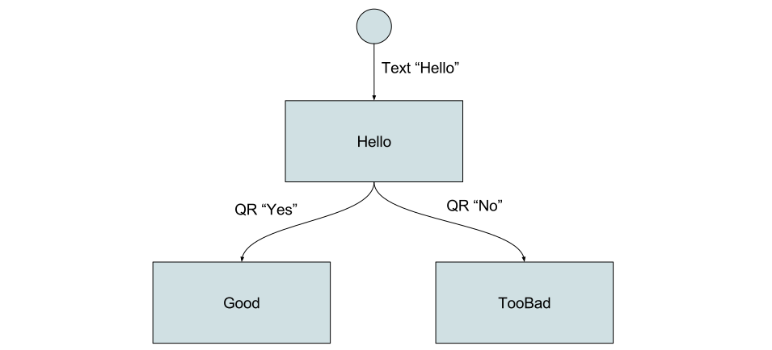

Get Started
===========

BERNARD is a batteries-included framework to help you build a conversational
chatbot. Although it provides many different tools, there is 3 core services
it provides:

- Conversation flows, through the use of a finite-state machine.
- A uniform interface for all platforms
- A conversation-oriented translation system

We'll first introduce those base concepts and then dig into a first example
bot.

# Core concepts

If you want to see code directly, you can get lower on that page. However, this
framework is not made for one-liner quick starts but rather for large projects,
and thus requires you to get familiar with a few new concepts first.

## Conversation flow

This is the most fundamental thing in the bot. You can make a model of the
bot that looks like this:

Let's explain this a bit:

- The circle on top is the **initial state**. That's where the bot is initially
  and where it comes back when it finishes a flow.
- The arrows are **transitions**. A transition is triggered by an event lie
  "the user says XXX" or "the user clicks the menu" and so on.
- The rectangles are **states**. When the bot reaches a state, then messages
  are sent to the user.

### Finite-state machine

This is basically a
[finite-state machine](https://en.wikipedia.org/wiki/Finite-state_machine).
Don't get lost on the Wikipedia article though, you don't need more than what
is explained here.

To explain in a different fashion, you have a finite number of states in your
bot (the rectangles). When a user does something, the bot looks at states you
can transition to from the current state.

### Transitions

How does the bot decide which transition to follow?

Each transition has an associated trigger. At each event, all transitions
will evaluate the chances that the current event triggers them. Let's take
an example:

Take the graph from above. Let's suppose that the user is in the "Hello" state.
Now the user says "Yes". The bot engine looks at the text message and sees
things this way: there is a 100% probability that the user triggers the "Yes"
transition and 0% chances that the user triggers the "No" transition. In this
case, it will then trigger the "Yes" transition.

### Chronology

Let's see how things happen through time:

1. The user says "hello"
2. One candidate transition is polled: the one from "initial" to "hello".
3. The transition to the "hello" state wins and is triggered
4. The "hello" state handler is triggered and the bot sends messages
5. The current state is marked to be "hello"

### Advices

This finite-state machine approach is fundamental. The key of understanding
the framework is in there. If those explanations are not clear enough, please
file an issue

Also, it is very important to draw your bot on paper (or Google Draw) before
actually making it. Otherwise you'll get lost. BERNARD will eventually have
an interface to do it, but not yet.

## Uniform interface

One of the main goals of BERNARD is to help people keep the same code and
processes across platforms. In order to provide this, the BERNARD API makes a
few promises:

- If something works one way on one platform, it will work the same way for
  other platforms (eg sending text is always done the same way)
- If you want to use a platform-specific feature that does not exist on other
  platforms, you should be able to.
- Don't make magic and don't make things behind your back

### Layering system

If you look at the different platforms, there is many things that can be done.
Some allow quick replies with text messages, some allow to share text, pictures
and location in the same message, and so on.

To help work with this complexity, BERNARD uses a system analogous to multipart
emails (the emails that can be both in HTML and in plain text). Each message
is made of layers: text, location, image, etc.

The concept is simple. When you receive a message, you can look for just the
layer(s) you are interested by, and when you send a message you can send
whichever layers you want then the platform will handle it if it can.

## Translation system

Most translation systems allow you to make your translation vary according
to the language and the count of items. Eg you can say "in english you say
'0 items', '1 item' and so on".

But in the world of bots, this is too limited. Beyond the fact that compiled
`.mo` files make less and less sense today, what if you want your sentences
to change according to the gender of the person? Or what if you want your bot
to have several personalities? Or what if you want some messages to change
randomly?

We used to talk to users without knowing their gender. Now with bots we usually
know the gender. Let's take advantage of this.

The concept of this new system is then to consider that instead of two fixed
criterion you can have any number of criterion. Like, you can say that your
criterion are:

- Language: fr, en, de
- Gender: male, female, unknown
- Mood: normal, sarcastic, funny

This will make it possible to have a different sentence for each combination
of those. Like `(fr, male, sarcastic)` will sound different than
`(fr, female, normal)`.

Let's just mention that so far only the language dimension is handled, but in
a close future you'll be able to create all the dimensions you want.

# Installation

In this part we'll get you through creating your own bot.

TODO
