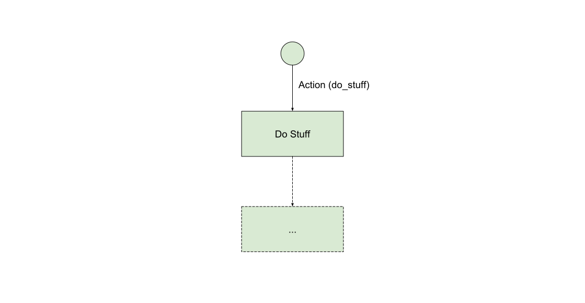
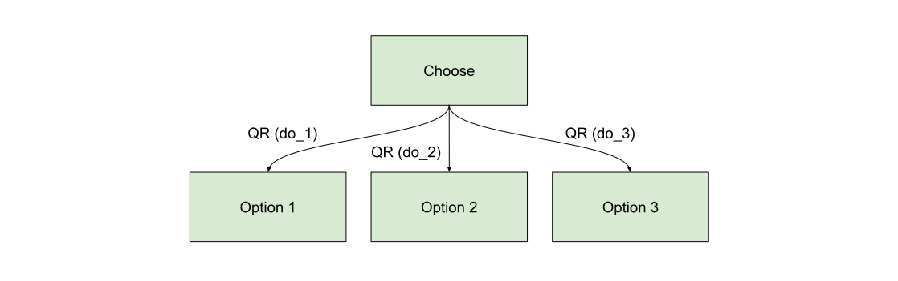
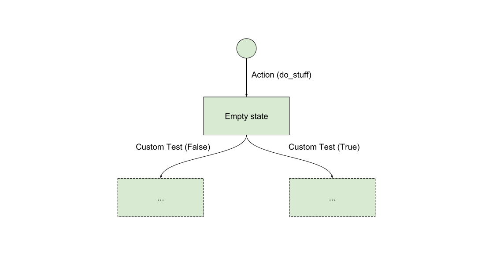

Patterns
========

After creating bots for some time, a few patterns emerge. Here's a list
of flow patterns that might help future bot builders to navigate in this
new way of thinking.

## Menu

Most platforms let you define some kind of menu. Facebook menus will
result in `Postback` messages while Telegram menus will be treated as
`BotCommand`. While you might have to use different triggers for both,
the resulting transition will look like this:



This transition is either:

- `trg.Action.builder('do_stuff')` for Facebook
- `trg.Equal.builder(tgr.BotCommand('do_stuff'))` for Telegram

Then you can connect any flow you want following this.

## Branch

Usually you can use quick replies (or assimilated) to create a
branching pattern. Aka to make the user choose a direction to take in
the flow.



There is two ways of doing this:

- Either by using buttons (FB or Telegram by example) which trigger a
  `Postback` message. In this case, you can use `Action` as trigger.
- Either by using quick replies (FB only). In this case, the `Choice`
  trigger is particularly fitting for your need.

Example of a `Choice` trigger to do some branching:

```python
trg.Choice.builder(slug='foo')
```

## Filter

The filter pattern is similar to the branch pattern in the sense that
the user is presented with some choices (as buttons or quick replies),
however when they click the buttons the state will loop back onto itself
and possibly change some filtering parameters as to what should be
displayed.


Example of a `Choice` trigger to do some filtering:

```python
trg.Choice.builder()
```

## Background check

Sometimes you want to take different branches depending on things that
you know about your user. By example, is they linked to your website or
just anonymous?



This kind of check usually requires you to implement your custom
trigger because the check you are doing is a call to your API.

Please note that each trigger is evaluated individually and in parallel.
So for instance, if your `Custom Test` is an API call, this would
trigger two simultaneous calls to the remote API, which is not
necessarily a good idea. In order to avoid this, instead of inheriting
from `BaseTrigger` you can rather implement a `SharedTrigger` which is
specifically designed for this kind of cases. By example:

```python
from bernard.engine.triggers import SharedTrigger
from .api import custom_check


class ApiCallTrigger(SharedTrigger):
    def __init__(self, request, expect):
        super().__init__(request)
        self.expect = expect

    async def call_api(self):
        return await custom_check()

    async def compute_rank(self, value):
        return 1. if value == self.expect else .0
```

In the previous example, `custom_check()` performs the check and returns
a boolean. The `call_api()` will only be called once.

Then the `compute_rank()` function will be called with the resulting
value as many times as the check exists.

Please note that for this to work, you need to create `internal`
transitions. By example:

```python
transitions = [
    Tr(
        dest=EmptyState,
        factory=trg.Action.builder('do_stuff'),
    ),
    Tr(
        dest=StateIfTrue,
        origin=EmptyState,
        factory=ApiCallTrigger.builder(expect=True),
        internal=True,
    ),
    Tr(
        dest=StateIfFalse,
        origin=EmptyState,
        factory=ApiCallTrigger.builder(expect=False),
        internal=True,
    ),
]
```
