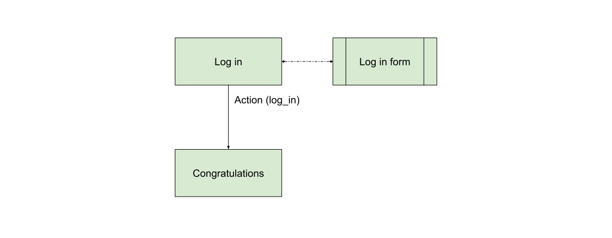

Patterns
========

After creating bots for some time, a few patterns emerge. Here's a list
of flow patterns that might help future bot builders to navigate in this
new way of thinking.

## Menu

Most platforms let you define some kind of menu. Facebook menus will
result in `Postback` messages while Telegram menus will be treated as
`BotCommand`. While you might have to use different triggers for both,
the resulting transition will look like this:


This transition is either:

- `trg.Action.builder('do_stuff')` for Facebook
- `trg.Equal.builder(tgr.BotCommand('do_stuff'))` for Telegram

Then you can connect any flow you want following this.

## Branch

Usually you can use quick replies (or assimilated) to create a
branching pattern. Aka to make the user choose a direction to take in
the flow.


There is two ways of doing this:

- Either by using buttons (FB or Telegram by example) which trigger a
  `Postback` message. In this case, you can use `Action` as trigger.
- Either by using quick replies (FB only). In this case, the `Choice`
  trigger is particularly fitting for your need.

Example of a `Choice` trigger to do some branching:

```python
trg.Choice.builder(slug='foo')
```

## Filter

The filter pattern is similar to the branch pattern in the sense that
the user is presented with some choices (as buttons or quick replies),
however when they click the buttons the state will loop back onto itself
and possibly change some filtering parameters as to what should be
displayed.


Example of a `Choice` trigger to do some filtering:

```python
trg.Choice.builder()
```

## Train jumping

Sometimes, you want some parts of the flow to connect to each other. By
example, suppose that you make a food deliver bot:

- If you ask "what is my order status?" it should reply with the current
  order status.
- When you complete an order, you want to directly display this status

You might be tempted to handle this from within the handler, but
actually it is much more simple and readable to handle it using the
flow:


Now, you might note that "Anything" is underlined. That is because it is
not a regular transition that waits on user input but rather an
*internal* transition that is automatically evaluated when the handling
of the previous state is done.

This flow would be implemented the following way:

```python
transitions = [
    # ...

    Tr(
        dest=CurrentStatus,
        factory=trg.Action.builder('order_status'),
    ),
    Tr(
        dest=CurrentStatus,
        origin=OrderComplete,
        factory=trg.Anything.builder(),
        internal=True,
    ),
]
```

## Background check

Sometimes you want to take different branches depending on things that
you know about your user. By example, is they linked to your website or
just anonymous?


This kind of check usually requires you to implement your custom
trigger because the check you are doing is a call to your API.

Please note that each trigger is evaluated individually and in parallel.
So for instance, if your `Custom Test` is an API call, this would
trigger two simultaneous calls to the remote API, which is not
necessarily a good idea. In order to avoid this, instead of inheriting
from `BaseTrigger` you can rather implement a `SharedTrigger` which is
specifically designed for this kind of cases. By example:

```python
from bernard.engine.triggers import SharedTrigger
from .api import custom_check


class ApiCallTrigger(SharedTrigger):
    def __init__(self, request, expect):
        super().__init__(request)
        self.expect = expect

    async def call_api(self):
        return await custom_check()

    async def compute_rank(self, value):
        return 1. if value == self.expect else .0
```

In the previous example, `custom_check()` performs the check and returns
a boolean. The `call_api()` will only be called once.

Then the `compute_rank()` function will be called with the resulting
value as many times as the check exists.

Please note that for this to work, you need to create `internal`
transitions. By example:

```python
transitions = [
    Tr(
        dest=EmptyState,
        factory=trg.Action.builder('do_stuff'),
    ),
    Tr(
        dest=StateIfTrue,
        origin=EmptyState,
        factory=ApiCallTrigger.builder(expect=True),
        internal=True,
    ),
    Tr(
        dest=StateIfFalse,
        origin=EmptyState,
        factory=ApiCallTrigger.builder(expect=False),
        internal=True,
    ),
]
```

## Window

While bots are really useful to provide instant services, some parts of
the service work way better inside a webview. By example if you want
to ask for some password or some payment details you'll need to go
through a webview since you're collecting sensitive data that wouldn't
be fit for a chat (which is historized).

One of the main goals of BERNARD is helping you create those webview
by providing means of communication between the webview and the bot.
You will find all the information you need in the
[bernard.js](https://www.npmjs.com/package/bernard-js) package which is
specifically made to help you deal with the technical side of this.

Here we'll rather explain the overview of the *Window* pattern, which
allows to do part of your flow within a webview. It's useful for things
like:

- Log-in/Registration
- Payment/checkout
- User profiling
- Anything with a lot of fields or requiring to put in secrets

In this case, we'll consider a bot that allows you to log in:

1. In the conversation, display a "Log in" button (using a
   [Facebook Button Template](layers/facebook.md#buttontemplate), by
   example)
2. The user opens the webview by clicking the button
3. They log in with their username and password
4. The window closes
5. The bot tells them "Congratulations!"



In this case, the "Log in" state will open a webview with a login form,
which in the nominal case will:

1. Ask the user for his login/password
2. Authenticate against your backend (it's up to you! have a look at the
   [`api_postback_me`](./middlewares.md#api_postback_me) middleware for
   more information).
3. Confirm the login to the bot

```javascript
bernard.sendPostback(token, {action: 'log_in'));
```

4. Close the window while the bot replies to your postback, saying
   "Congratulations!"
